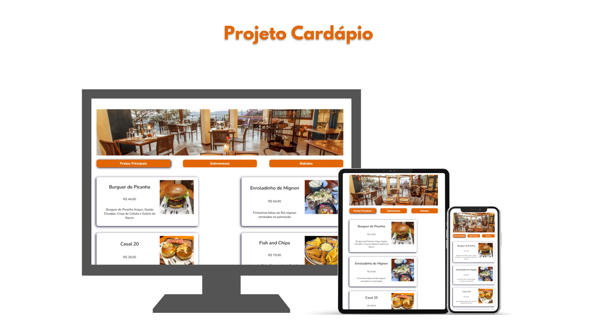

# Projeto Cardápio de Restaurante



## Índice
- [Sobre o projeto](#sobre-o-projeto)
- [Funcionalidades](#funcionalidades)
- [Tecnologias utilizadas](#tecnologias-utilizadas)
- [Clonar repositório](#clonar-repositório)
- [Protótipo](#protótipo)

## Sobre o projeto
Este projeto consiste em uma aplicação web desenvolvida em React, que simula o cardápio digital de um restaurante. Além do mais, conta com uma interface intuitiva que permite aos usuários explorar diferentes opções entre as categorias de pratos, sobremesas e bebidas.

## Funcionalidades
- Navegar entre as três categorias do menu: Pratos Principais, Sobremesas e Bebidas
- Expor informações de itens do cardápio, como nome, descrição, preço e uma imagem correspondente.

## Tecnologias utilizadas
- **HTML5**: Estrutura do projeto
- **CSS3**: Estilização da interface
- **JavaScript**: Lógica da aplicação.
- **React**: Componentização e controle de estado para navegação entre categorias do cardápio.

## Clonar repositório
Você também pode clonar este repositório e rodar na sua máquina local:
   ```bash
   git clone https://github.com/lePerez2104/projeto-cardapio.git
   ```
Instale as dependências:
```bash
npm install
```
Execute o projeto:
```bash
npm start
```
Acesse a aplicação pelo navegador:
```bash
http://localhost:3000
```

## Protótipo
Acesse o protótipo do projeto e experimente você mesmo:
<br>
https://projeto-cardapio-leticia.vercel.app/